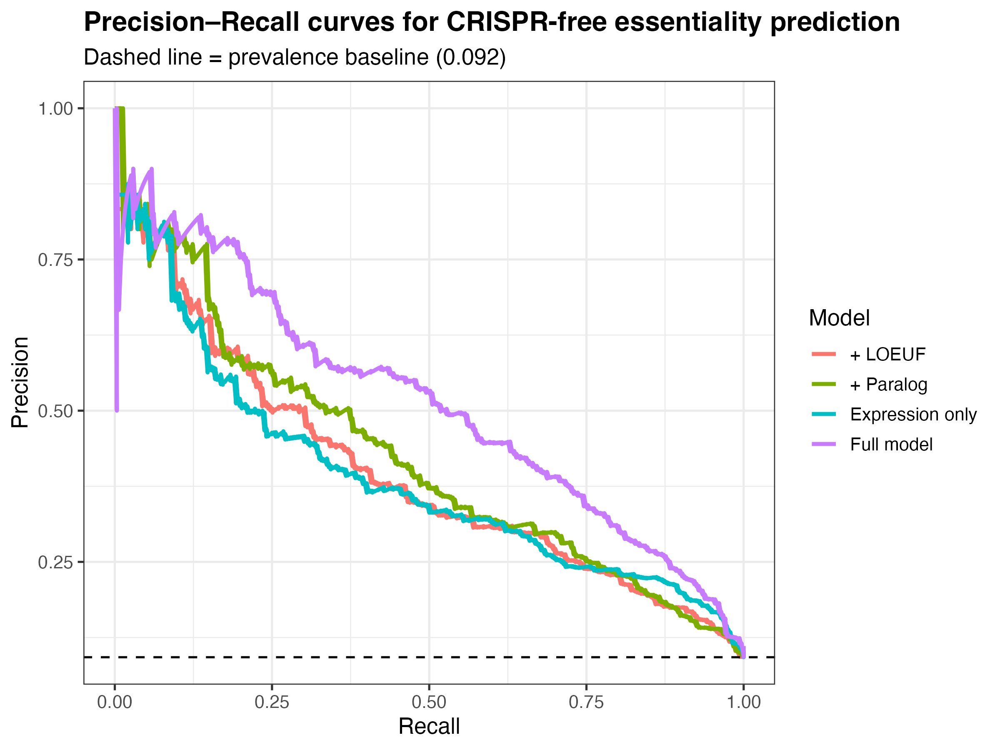

<hr>
title: "README"
author: "Gabriel Cabrera"
date: "2026-01-30"
output: html_document
editor_options: 
  markdown: 
    wrap: 72
<hr>

```{r setup, include=FALSE}
knitr::opts_chunk$set(echo = TRUE)
```

# CRISPR-free Essentiality
 
> **Predicting gene essentiality from unperturbed biological priors — without training on CRISPR perturbation data.**
 
Gene essentiality can be predicted with **AUROC 0.889** using only evolutionary and expression features, with no CRISPR training data. This represents a **~5× enrichment** over the prevalence baseline (AUPRC: 0.512 vs. 0.092).
 
<hr>

## Table of Contents
 
- [Overview](#overview)
- [Scientific Question](#scientific-question)
- [Repository Structure](#repository-structure)
- [Data Sources](#data-sources)
- [Feature Engineering](#feature-engineering)
- [Results](#results)
- [Interpretation](#interpretation)
- [Reproducing This Work](#reproducing-this-work)
- [Limitations & Future Directions](#limitations--future-directions)
 
<hr>
 
 

## Overview

Large-scale CRISPR knockout screens have enabled systematic
identification of essential genes, but remain costly, context-limited,
and in-feasible in many biological settings. This project explores
whether **gene essentiality can be predicted without using CRISPR data
during model training**, relying instead on unperturbed molecular and
evolutionary signals.

We construct a gene-level feature table integrating:
| Biological Scale | Features |
|---|---|
| Cell-state | Mean and variance of CCLE bulk RNA-seq expression |
| Organism-level | gnomAD LOEUF constraint (intolerance to loss-of-function) |
| Redundancy | Paralog count (Ensembl) |
| Systems-level | PPI network degree (STRING) |
 
Models are trained **exclusively** on these non-CRISPR features and evaluated against independent CRISPR-based benchmarks (DepMap Chronos).
 
<hr>
## Scientific Question

> *Is gene essentiality partially encoded in unperturbed biological
> state and long-term evolutionary constraint, prior to experimental
> perturbation?*

This project treats essentiality as a **latent biological property**
that can be inferred without exposure to perturbation labels.

------------------------------------------------------------------------

## Data Sources (raw data not redistributed)

Raw datasets are not included in this repository due to size and licensing restrictions. Scripts are provided to reproduce all derived features from the sources below.
 
| Source | Version | Purpose |
|---|---|---|
| [DepMap Chronos](https://depmap.org/portal/) | 23Q4 | Evaluation-only essentiality labels |
| [CCLE RNA-seq](https://depmap.org/portal/download/) | — | Baseline expression features |
| [gnomAD](https://gnomad.broadinstitute.org/) | v2.1.1 | Human genetic constraint (LOEUF) |
| [Ensembl](https://ensembl.org/) | GRCh38 | Paralog relationships |
| [STRING](https://string-db.org/) | v12.0 | Protein–protein interaction network |
 
> **Ground truth**: Binary essentiality labels are derived from median Chronos scores (threshold: Chronos < −0.5). Labels are used **for evaluation only** and are never incorporated into feature construction.
 

## Feature Engineering

The current milestone focuses on building a **CRISPR-free feature
table** at the gene level.

The feature table is constructed at the gene level by integrating signals across four biological scales:
 
```
Gene
 ├── Cell-state         →  mean expression, expression variance (CCLE)
 ├── Organism-level     →  LOEUF score (gnomAD)
 ├── Redundancy         →  paralog count (Ensembl)
 └── Systems-level      →  PPI network degree (STRING)
```
 

### Ground truth (evaluation only)

-   Binary essentiality labels derived from median Chronos scores
-   Threshold: Chronos \< −0.5
-   Labels are **never used during feature construction**

------------------------------------------------------------------------

## Baseline modeling results

### Ablation — Single Split (80/20, seed = 42)
 
| Model | AUROC | AUPRC |
|---|---|---|
| Expression only | 0.847 | 0.389 |
| + LOEUF | 0.833 | 0.397 |
| + Paralog count | 0.839 | 0.424 |
| **Full model** (expr + LOEUF + paralogs + network) | **0.889** | **0.512** |
| Prevalence baseline | — | 0.092 |
 
The full model achieves a **~5.6× AUPRC enrichment** over the random baseline.
 
### Multi-Seed Robustness
 
To confirm that performance is not driven by a particular train/test split, the 80/20 split was repeated across multiple random seeds. Key findings:
 
- The **full model performs best across all seeds**, confirming that the result is not a lucky split
- **Each feature block contributes independent signal** — no single feature is sufficient on its own
- **Expression alone is a strong baseline** but meaningfully improves with constraint, redundancy, and network features
- **Essentiality is multifactorial**: the convergence of evolutionary, expression, and network signals outperforms any single axis
 
See `results/tables/metrics_v1_multiseed_summary.csv` for full multi-seed summary statistics.
 

 
<hr>
 
## Interpretation
 
Standardized logistic regression coefficients (per 1 SD increase in each feature):
 
| Feature | Direction | Interpretation |
|---|---|---|
| Mean expression | ↑ Positive | Highly expressed genes are more likely essential |
| PPI network degree | ↑ Positive | Hub genes in interaction networks tend to be essential |
| Expression variance | ↓ Negative | Stably expressed genes are more essential than variable ones |
| Paralog count | ↓ Negative | Genes with redundant paralogs are buffered against lethality |
| LOEUF | ↓ Negative | Genes under strong evolutionary constraint are more likely essential |
 
Mean expression and network degree are the **strongest positive predictors**. Paralog count and expression variance are the **strongest negative predictors**. LOEUF contributes a moderate negative effect consistent with evolutionary constraint theory.

See [`results/figures/coefficients_full_glm.csv`](results/figures/coefficients_full_glm.csv) for full standardized coefficient values.
 
### Output Artifacts
 
| File | Description |
|---|---|
| `results/tables/logreg_training_summary.csv` | AUROC/AUPRC, prevalence, split info |
| `results/tables/logreg_test_predictions.csv` | Per-gene predicted essentiality probabilities |
| `results/tables/logreg_coefficients.csv` | Standardized model coefficients |
| `results/tables/metrics_v1_multiseed.csv` | Per-seed performance metrics |
| `results/tables/metrics_v1_multiseed_summary.csv` | Summary statistics across seeds |
 
<hr>


## Limitations & Future Directions
 
### Current Limitations
 
- **Paralog-aware splitting**: Paralogs of training genes may appear in the test set, creating a potential source of information leakage. Future splits should be paralog-aware.
- **Cell line aggregation**: Chronos scores are aggregated to a median across cell lines, collapsing meaningful context-specificity. Per-lineage models may reveal tissue-specific essentiality patterns.
- **Model class**: Logistic regression was chosen for interpretability. Non-linear models (gradient boosting, GNNs over the PPI network) may capture interaction effects not modeled here.
 
### Future Directions
 
- [ ] Paralog-aware train/test splitting
- [ ] Per-lineage essentiality modeling (hematologic vs. solid tumors)
- [ ] Negative control validation (permuted labels, random gene sets)
- [ ] Comparison to published CRISPR-free essentiality baselines
- [ ] Model calibration assessment (Brier score, reliability diagrams)
- [ ] Extension to non-cancer contexts where CRISPR screens are infeasible
 
<hr>
 
## Citation
 
If you use this work, please cite this repository:
 
```
@misc{cabrera2024crisprfree,
  author = {Cabrera, Gabriel},
  title  = {CRISPR-free Essentiality},
  year   = {2024},
  url    = {https://github.com/GabrielCabrera03/crispr-free-essentiality}
}
```
 
<hr>
